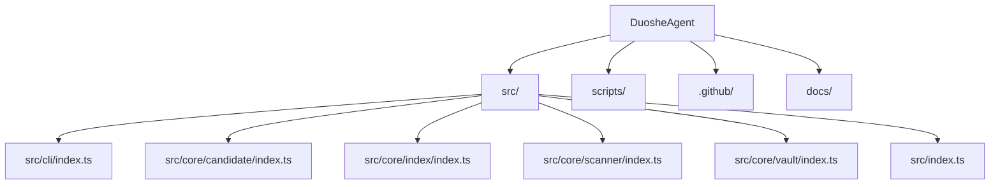

# Code Map

<!-- DUOSHE-DRAFT: this section was auto-generated by `duoshe init`.
     Review and edit freely. Add <!-- USER-CONFIRMED --> on a line above any
     paragraph you want `duoshe rescan` to preserve. -->

> A compact map of the repository shape for AI agents. Keep this practical:
> entry points, ownership boundaries, and files that deserve extra caution.

## System graph

## Runtime and stack signals

- `package.json` -> TypeScript (npm)

## Entry points

- `src/cli/index.ts` (main)
- `src/core/candidate/index.ts` (main)
- `src/core/index/index.ts` (main)
- `src/core/scanner/index.ts` (main)
- `src/core/vault/index.ts` (main)
- `src/index.ts` (main)

## Directory map

| Path | Likely role | Files |
| --- | --- | ---: |
| `src/` | source code | 44 |
| `scripts/` | build/dev scripts | 2 |
| `.github/` | GitHub workflows/config | 1 |
| `docs/` | documentation | 1 |

## Hot files

- `README.md` — 2 commits in last 30 days
- `docs/GIT-SETUP.md` — 1 commits in last 30 days
- `scripts/publish-to-github.ps1` — 1 commits in last 30 days
- `.gitattributes` — 1 commits in last 30 days
- `.github/workflows/ci.yml` — 1 commits in last 30 days
- `.gitignore` — 1 commits in last 30 days
- `.npmignore` — 1 commits in last 30 days
- `AGENTS.md` — 1 commits in last 30 days
- `CLAUDE.md` — 1 commits in last 30 days
- `DESIGN.md` — 1 commits in last 30 days

## Human notes

_Use `duoshe guide` to add project-specific routing notes, ownership rules, and areas AI agents should inspect first._

---

_Generated by DuoShe 2026-05-29T05:24:20.576Z. Refresh with `duoshe rescan`._
